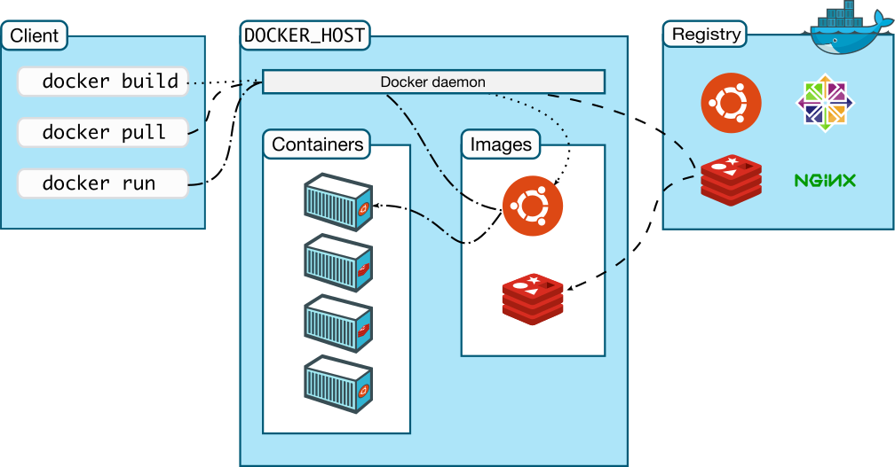

# Chapter 01 - Introduction

### What is docker and why it is used?
Docker is an open platform for developing, shipping, and running applications. Docker enables you
to separate your applications from your infrastructure so you can deliver software quickly. With 
Docker, you can manage your infrastructure in the same ways you manage your applications.

---

### Docker architecture and basic concepts:

**Docker client:** The Docker client ( docker ) is the primary way that many Docker users interact
with Docker. When you use commands such as docker run , the client sends these commands to dockerd
, which carries them out. The docker command uses the Docker API. The Docker client can communicate
with more than one daemon.

**Docker Daemon:** A persistent background process that manages Docker images, containers, networks,
and storage volumes. The Docker daemon constantly listens for Docker API requests and processes them.

**Docker registry:** The Registry is a stateless, highly scalable server side application that stores
and lets you distribute Docker images.

**Docker image:** Application code, libraries, tools, dependencies and other files needed to make an
application run.

**Docker container:** A lightweight, standalone, executable package of software that includes 
everything needed to run an application(code, runtime, system tools, system libraries and settings).
